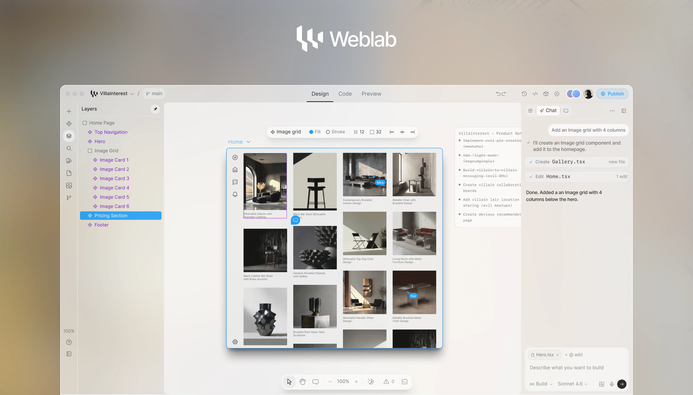

<!-- Improved compatibility of back to top link: See: https://github.com/othneildrew/Best-README-Template/pull/73 -->

<h3>Weblab</h3>

  

    Cursor for Designers
     
    <a href="https://docs.weblab.build"><strong>Explore the docs »</strong></a>
     
     
    <a href="https://github.com/Ludvig-Hedin/Weblab/issues/new?labels=bug&template=bug-report---.md">Report Bug</a>
    ·
    <a href="https://github.com/Ludvig-Hedin/Weblab/issues/new?labels=enhancement&template=feature-request---.md">Request Feature</a>
  

  <!-- PROJECT SHIELDS -->
<!--
*** I'm using markdown "reference style" links for readability.
*** Reference links are enclosed in brackets [ ] instead of parentheses ( ).
*** See the bottom of this document for the declaration of the reference variables
*** for contributors-url, forks-url, etc. This is an optional, concise syntax you may use.
*** https://www.markdownguide.org/basic-syntax/#reference-style-links
-->
<!-- [![Contributors][contributors-shield]][contributors-url]
[![Forks][forks-shield]][forks-url]
[![Stargazers][stars-shield]][stars-url]
[![Issues][issues-shield]][issues-url]
[![Apache License][license-shield]][license-url] -->

> 📚 **Looking for documentation?** See [`docs/README.md`](./docs/README.md) for the master table of contents covering agent docs, guides, audits, working notes, product/marketing, feature plans, and archive. The published documentation site source lives in [`apps/docs`](./apps/docs).

[中文](https://www.readme-i18n.com/Ludvig-Hedin/Weblab?lang=zh) |
[Español](https://www.readme-i18n.com/Ludvig-Hedin/Weblab?lang=es) |
[Deutsch](https://www.readme-i18n.com/Ludvig-Hedin/Weblab?lang=de) |
[français](https://www.readme-i18n.com/Ludvig-Hedin/Weblab?lang=fr) |
[Português](https://www.readme-i18n.com/Ludvig-Hedin/Weblab?lang=pt) |
[Русский](https://www.readme-i18n.com/Ludvig-Hedin/Weblab?lang=ru) |
[日本語](https://www.readme-i18n.com/Ludvig-Hedin/Weblab?lang=ja) |
[한국어](https://www.readme-i18n.com/Ludvig-Hedin/Weblab?lang=ko)

# Weblab

An open-source, visual-first code editor for building and editing real web
projects with AI. Weblab lets you generate projects, inspect the live preview,
edit visually, and keep those changes connected to code.

Weblab currently focuses on React and web projects such as Next.js, Vite,
Remix, Astro, TanStack Start, and static HTML, with first-class support for
TailwindCSS.

### 🚧 🚧 🚧 Weblab is still under development 🚧 🚧 🚧

We're actively looking for contributors to help make Weblab for Web an
incredible prompt-to-build experience. Check the
[open issues](https://github.com/Ludvig-Hedin/Weblab/issues) for a full list of
proposed features (and known issues) to collaborate with other builders.

## What you can do with Weblab

- [x] Create web apps in seconds
  - [x] Start from text or image
  - [x] Use prebuilt templates
  - [x] Detect project frameworks automatically
  - [x] Import from Figma
  - [x] Import from GitHub repo
  - [ ] Make a PR to a GitHub repo (Coming soon)
- [x] Visually edit your app
  - [x] Use Figma-like UI
  - [x] Preview your app in real-time
  - [x] Manage brand assets and tokens
  - [x] Create and navigate to Pages
  - [x] Browse layers
  - [x] Manage project Images
  - [x] Detect and use Components – _Previously in
        [Weblab Desktop](https://github.com/Ludvig-Hedin/desktop)_
  - [ ] Drag-and-drop Components Panel (Coming soon)
  - [x] Use Branching to experiment with designs
- [x] Development Tools
  - [x] Real-time code editor
  - [x] Save and restore from checkpoints
  - [x] Run commands via CLI
  - [x] Connect with app marketplace
- [x] Deploy your app in seconds
  - [x] Generate sharable links
  - [x] Link your custom domain
- [x] Collaborate with your team
  - [x] Real-time editing
  - [x] Leave comments
- [ ] Advanced AI capabilities
  - [x] Queue multiple messages at once
  - [x] Use images as references and assets in a project
  - [ ] Setup and use MCPs in projects
  - [ ] Allow Weblab to use itself as a toolcall for branch creation and iteration
- [x] Advanced project support
  - [x] Support non-Next.js projects
  - [x] Support non-Tailwind projects

## Getting Started

Use our [hosted app](https://weblab.build) or
[run locally](https://docs.weblab.build/developers/running-locally).

### Usage

Import an existing project into Weblab, or start from scratch inside the
editor. Weblab is optimized for component-based web apps and can work with
Next.js, Vite, Remix, Astro, TanStack Start, and static HTML projects.

Use the AI chat to create or edit a project you're working on. At any time, you
can always right-click an element to open up the exact location of the element
in code.

 

Draw-in new divs and re-arrange them within their parent containers by
dragging-and-dropping.

 

Preview the code side-by-side with your site design.

 

Use Weblab's editor toolbar to adjust Tailwind styles, directly manipulate
objects, and experiment with layouts.

## Documentation

For full documentation, visit [docs.weblab.build](https://docs.weblab.build)

To see how to Contribute, visit
[Contributing to Weblab](https://docs.weblab.build/developers) in our docs.

## How it works

1. When you create an app, we load the code into a web container
2. The container runs and serves the code
3. Our editor receives the preview link and displays it in an iFrame
4. Our editor reads and indexes the code from the container
5. We instrument the code in order to map elements to their place in code
6. When the element is edited, we edit the element in our iFrame, then in code
7. Our AI chat also has code access and tools to understand and edit the code

This architecture can scale to any language or framework that displays DOM
elements declaratively, such as JSX, TSX, and HTML. Weblab is currently focused
on the modern web stack while keeping the framework layer extensible.

For a full walkthrough, check out our
[Architecture Docs](https://docs.weblab.build/developers/architecture).

### Our Tech Stack

#### Frontend and editor

- [Next.js](https://nextjs.org/) - App Router web application
- [React](https://react.dev/) - UI runtime
- [TailwindCSS](https://tailwindcss.com/) - Styling
- [MobX](https://mobx.js.org/) - Editor state management
- [CodeMirror](https://codemirror.net/) - Code editing
- [TipTap](https://tiptap.dev/) - AI prompt composer

#### Backend, data, and auth

- [Convex](https://www.convex.dev/) - Application backend, realtime data, and file storage
- [Clerk](https://clerk.com/) - Authentication and user identity
- [tRPC](https://trpc.io/) - Legacy API surface while remaining call sites migrate to Convex
- [Supabase](https://supabase.com/) + [Drizzle](https://orm.drizzle.team/) - Legacy data layer retained for migration compatibility

#### AI

- [AI SDK](https://ai-sdk.dev/) - LLM client and streaming UI
- [OpenRouter](https://openrouter.ai/) - LLM model provider
- [Morph Fast Apply](https://morphllm.com) - Fast apply model provider
- [Relace](https://relace.ai) - Fast apply model provider

#### Sandboxes, deployment, and infrastructure

- [CodeSandbox SDK](https://codesandbox.io/docs/sdk) - Cloud dev sandboxes
- [Vercel Sandbox](https://vercel.com/docs/vercel-sandbox) - Optional cloud sandbox runtime
- [Freestyle](https://www.freestyle.sh/) - Managed app hosting
- [Railway](https://railway.com/) - Weblab app and docs deployment

#### Runtime

- [Bun](https://bun.sh/) - Monorepo package manager, scripts, and runtime
- [Docker](https://www.docker.com/) - Container management

## Contributing

If you have a suggestion that would make this better, please fork the repo and
create a pull request. You can also
[open issues](https://github.com/Ludvig-Hedin/Weblab/issues).

See the [CONTRIBUTING.md](CONTRIBUTING.md) for instructions and code of conduct.

## Contact

- Team:
  [Email](mailto:contact@weblab.build)
- Project:
  [https://github.com/Ludvig-Hedin/Weblab](https://github.com/Ludvig-Hedin/Weblab)
- Website: [https://weblab.build](https://weblab.build)

## License

Distributed under the Apache 2.0 License. See [LICENSE.md](LICENSE.md) for more
information.

<!-- https://www.markdownguide.org/basic-syntax/#reference-style-links -->

[contributors-shield]: https://img.shields.io/github/contributors/Ludvig-Hedin/Weblab.svg?style=for-the-badge
[contributors-url]: https://github.com/Ludvig-Hedin/Weblab/graphs/contributors
[forks-shield]: https://img.shields.io/github/forks/Ludvig-Hedin/Weblab.svg?style=for-the-badge
[forks-url]: https://github.com/Ludvig-Hedin/Weblab/network/members
[stars-shield]: https://img.shields.io/github/stars/Ludvig-Hedin/Weblab.svg?style=for-the-badge
[stars-url]: https://github.com/Ludvig-Hedin/Weblab/stargazers
[issues-shield]: https://img.shields.io/github/issues/Ludvig-Hedin/Weblab.svg?style=for-the-badge
[issues-url]: https://github.com/Ludvig-Hedin/Weblab/issues
[license-shield]: https://img.shields.io/github/license/Ludvig-Hedin/Weblab.svg?style=for-the-badge
[license-url]: https://github.com/Ludvig-Hedin/Weblab/blob/master/LICENSE.txt
[linkedin-shield]: https://img.shields.io/badge/-LinkedIn-black.svg?logo=linkedin&colorB=555
[linkedin-url]: https://www.linkedin.com/company/weblab
[twitter-shield]: https://img.shields.io/badge/-Twitter-black?logo=x&colorB=555
[twitter-url]: https://x.com/weblab
[discord-shield]: https://img.shields.io/badge/-Discord-black?logo=discord&colorB=555
[discord-url]: https://discord.gg/hERDfFZCsH
[React.js]: https://img.shields.io/badge/react-%2320232a.svg?logo=react&logoColor=%2361DAFB
[React-url]: https://reactjs.org/
[TailwindCSS]: https://img.shields.io/badge/tailwindcss-%2338B2AC.svg?logo=tailwind-css&logoColor=white
[Tailwind-url]: https://tailwindcss.com/
[Electron.js]: https://img.shields.io/badge/Electron-191970?logo=Electron&logoColor=white
[Electron-url]: https://www.electronjs.org/
[Vite.js]: https://img.shields.io/badge/vite-%23646CFF.svg?logo=vite&logoColor=white
[Vite-url]: https://vitejs.dev/
[product-screenshot]: assets/brand.png
[weave-shield]: https://img.shields.io/endpoint?url=https%3A%2F%2Fapp.workweave.ai%2Fapi%2Frepository%2Fbadge%2Forg_pWcXBHJo3Li2Te2Y4WkCPA33%2F820087727&cacheSeconds=3600&labelColor=#131313
[weave-url]: https://app.workweave.ai/reports/repository/org_pWcXBHJo3Li2Te2Y4WkCPA33/820087727
